1. ifconfig 查看物理机，虚拟网络卡是否启动  
2. 没有
3. dhcp 自动获取ip

# 虚拟机

### 软件准备 
  
  - VirtualBox (虚拟机box)(硬件)
  - CentOS-7-x86_64-Minimal-1511-2.iso (操作系统)

### 安装

1. 打开VirtualBox ,新建CentOS7,配置网络  

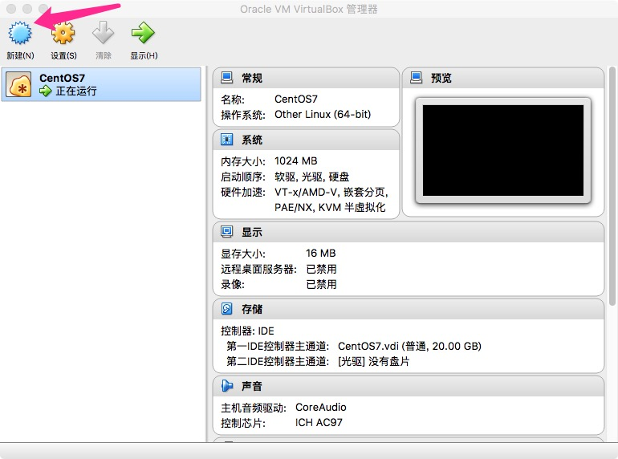  

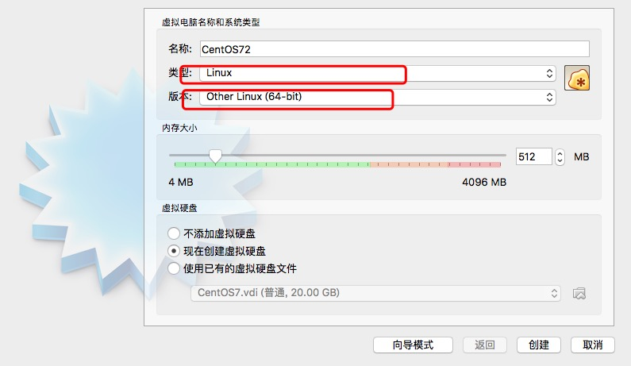  

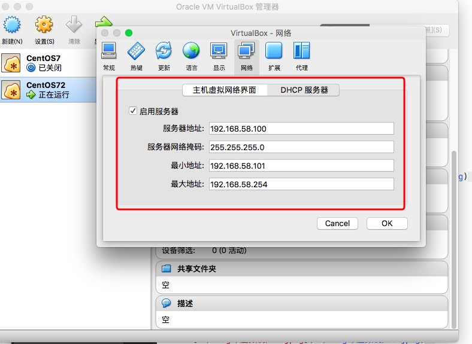  

[../image/虚拟机/02.jpeg](../image/虚拟机/02.jpeg)  

2. 启动  

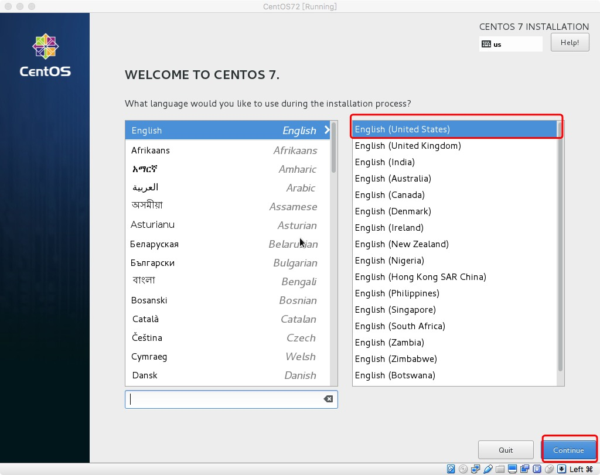  

- 磁盘大小设置  

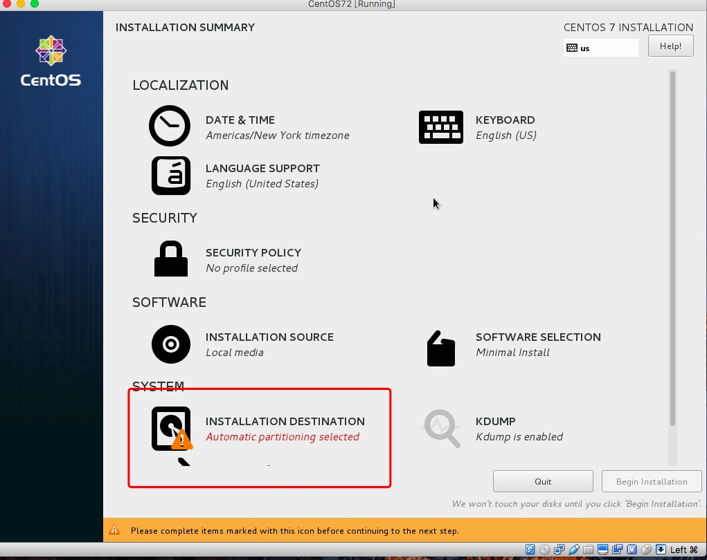  

- 设置密码  

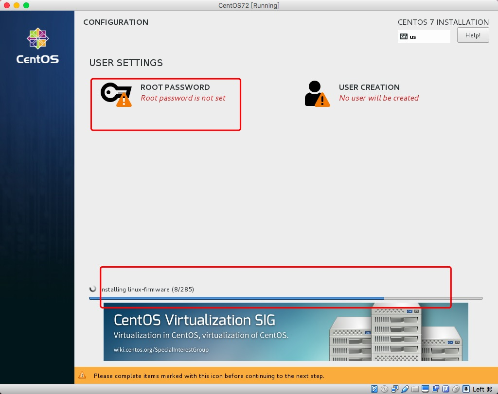  

-  安装完成  

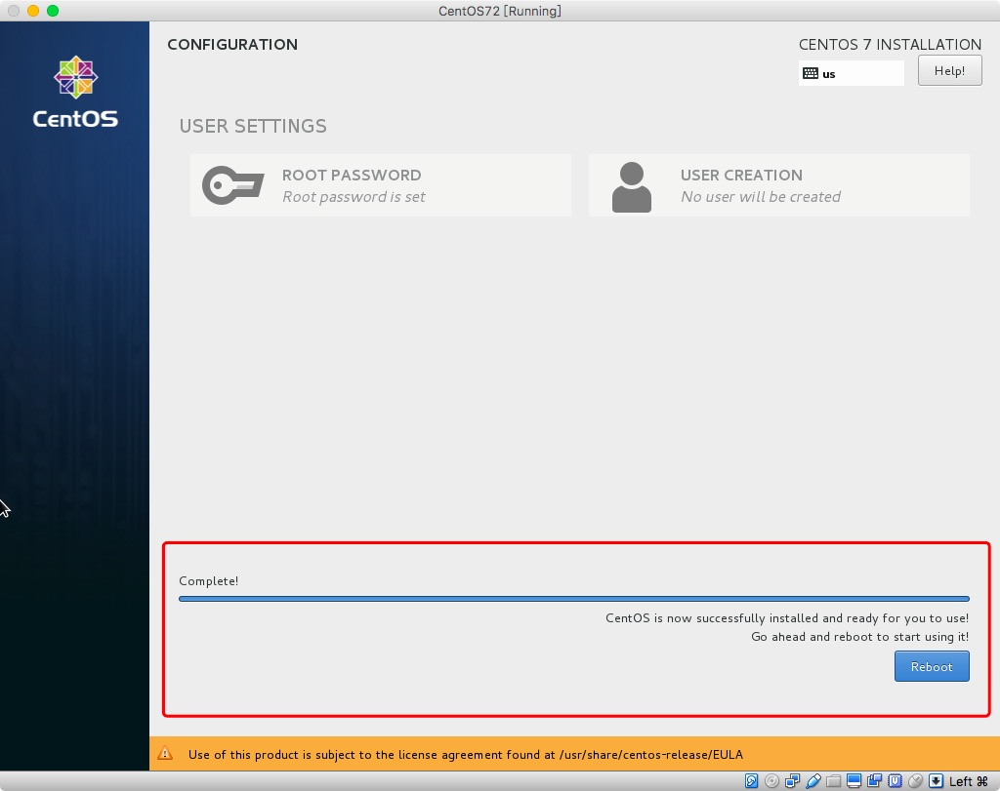  

- 启动 进入Linux终端  

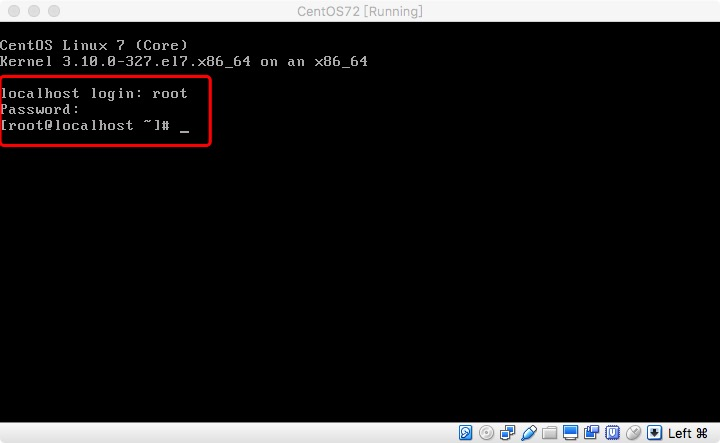  

ps: 本机终端输入 ifconfig 可查看当前网络状态  

  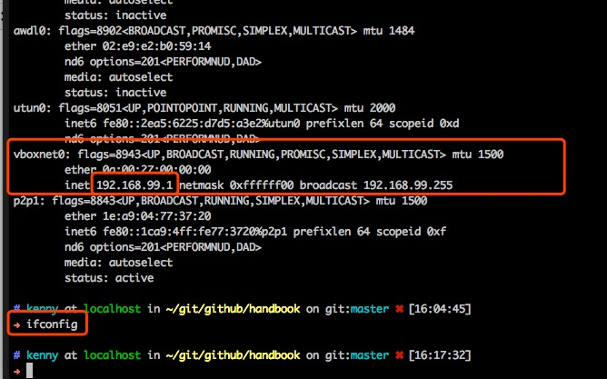  

  红框标示所安装的虚拟机ip  

  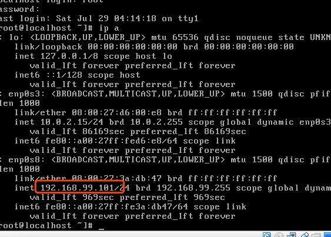  

  如果未发现虚拟机ip，则重新启动虚拟机，启动命令如图:  

  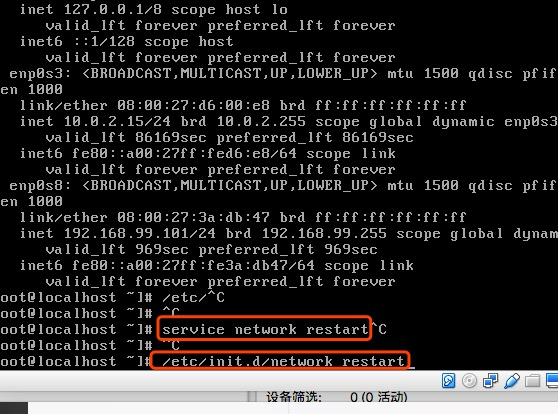  
    

- 进入 /etc/sysconfig/network-scripts/ 目录  

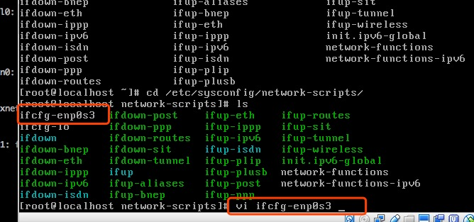  

- 打开当前虚拟机(我正在装的 >> vi ifcfg-enp0s8(自己装的名字都不一样))  
  修改虚拟机配置  
  BOOTPROTO:  dhcp 自动获取ip  
  ONBOOT: yes  开机启动虚拟机  

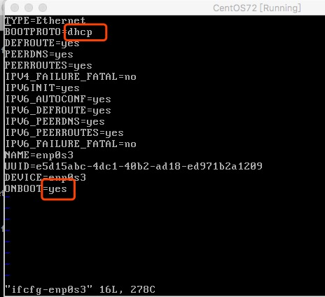  

- 修改完配置，重新启动虚拟机  

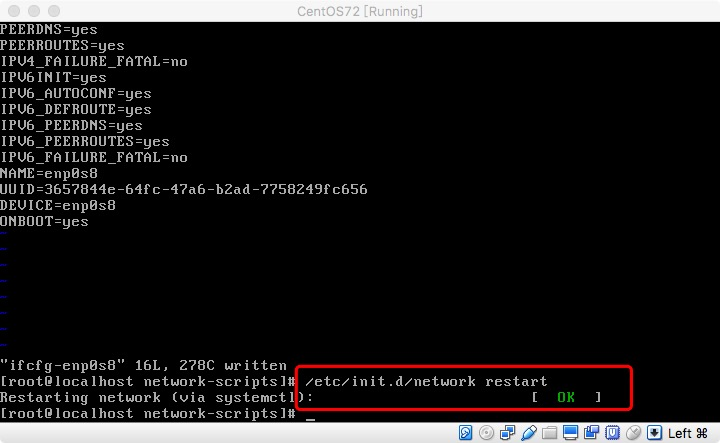  

- 查看是否已联网成功  
  输入命令： ping www.baidu.com  

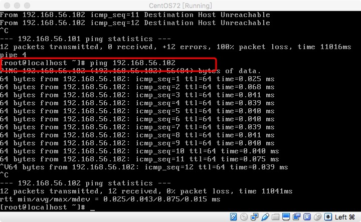  


- 出现访问时间 time...表示联网成功  


- 主机联虚拟机命令  

```
ssh root@192.168.58.100
```


- 跨机器传送文件  


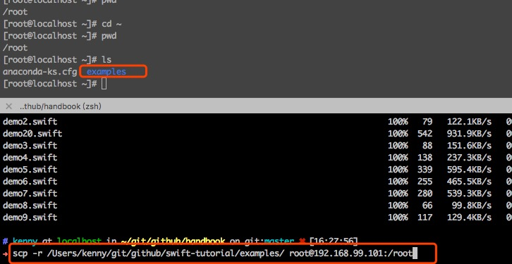  
